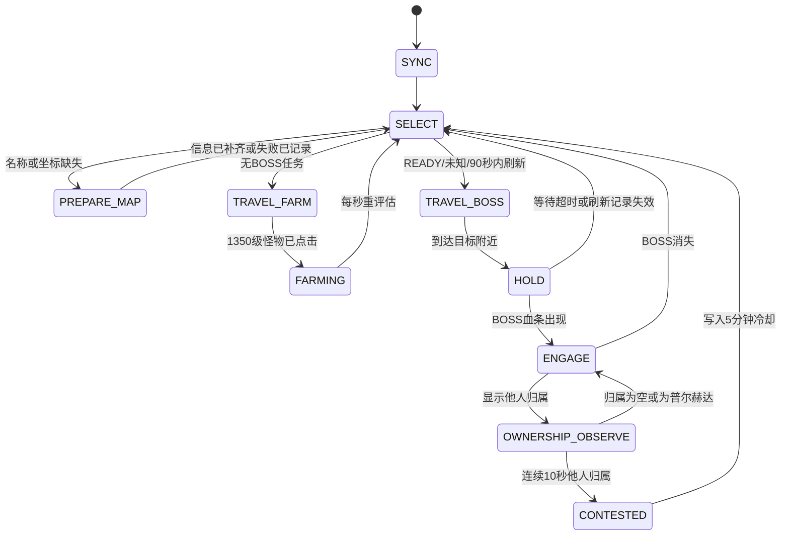

# 四风平原自动打 BOSS MVP 设计

## 目标

新增独立 Tampermonkey 脚本 `mu-boss-four-winds-mvp.user.js`，自动循环处理四风平原的四个野外 BOSS：在刷新前 90 秒前往并守点、开启挂机攻击、识别归属并放弃已被他人稳定占有的 BOSS；没有 BOSS 任务时，通过大地图的「1350级怪物」入口自动 farming。

脚本必须始终拥有唯一的当前目标和当前动作。任何读面板、开地图、寻路、守点、战斗或 farming 操作都必须有完成条件、超时和明确的后续状态，不能原地空转或在多个 BOSS 间反复来回。

## 固定范围

只处理下列四个目标，地图必须严格等于「四风平原」。坐标作为启动时的内置基线，并通过大地图的 BOSS 标记复核：

| 标识 | 名称 | 坐标 |
| --- | --- | --- |
| `ao-left` | 傲之煞 | 77,145 |
| `ao-right` | 傲之煞 | 182,164 |
| `angry-ao` | 愤怒傲之煞 | 179,79 |
| `rage-ao` | 狂暴傲之煞 | 82,88 |

不处理其他地图、BOSS、任务、传送、日常限制或道具消耗。新脚本不拦截 bundle，因此不会和现有 bundle patch 脚本冲突。

## 依赖与边界

- `window.__muBossRespawnOverlay` 是刷新记录的首选来源。读取其 `getRecords()` 和 `status()`，不修改其配置和数据。
- 新脚本内置最小 FairyGUI 扫描能力：读取当前地图/坐标、地图面板、BOSS 列表、1350级怪物入口、目标血条与归属文本，并触发现有 UI 节点点击。
- `mu-boss-bot.user.js` 仅作为 FGUI 扫描、节点激活和归属解析的参考实现；新脚本不能要求 `window.__muBossBot` 已注入，因为它当前可能未运行。
- 移动只通过游戏的内置大地图目标点击触发。不得直接修改角色位置、游戏网络包或 bundle。
- Z 键只在已确认自动挂机未开启时发送；禁止每个 tick 盲按，避免把已开启的挂机切换为关闭。

## 运行数据

每个固定目标在内存与本脚本 localStorage 中维护：

- 静态字段：`id`、`name`、`mapName`、`coordinate`。
- 刷新字段：`refreshAt`、`refreshInSeconds`、记录来源、最后更新时间、是否为未知刷新时间。
- 运行字段：`status`、`lastArrivalAt`、`lastOwner`、`ownerOtherSince`、`cooldownUntil`、失败次数。
- 当前上下文：唯一的 `currentTargetId`、`currentAction`、动作起始时间、验证截止时间与一次性重试标志。

刷新浮层中“没有刷新时间”不视为错误：它表示该 BOSS 尚未被击杀，或尚未在附近完成初始化。此时对应目标的状态为 `READY_UNKNOWN_TIMER`，需要直接前往；若 BOSS 存在则攻击，若显示倒计时则保存为已初始化刷新信息。

## 目标选择

每秒读取浮层和当前 UI 后，按以下顺序选择目标：

1. `READY_UNKNOWN_TIMER`：刷新时间未知，优先前往核实；发现 BOSS 则直接攻击。
2. `READY`：已出现且归属为空或为「普尔赫达」的 BOSS。
3. `PREPARE`：刷新倒计时不超过 90 秒的 BOSS，按最早 `refreshAt` 排序。
4. `FARM`：无上述 BOSS 任务时，选择大地图右侧的「1350级怪物」。

已经进入 `TRAVEL_BOSS` 或 `HOLD` 的目标被锁定，不因其他普通倒计时目标改变路线。仅在当前目标失效、寻路失败、被抢、或出现一个已存在的 `READY` BOSS 时允许切换，防止往返跑。

被确认抢走的目标冷却 5 分钟。该 BOSS 消失、刷新浮层出现新的刷新记录或记录的 `refreshAt` 变化时，立即解除冷却。

## 状态机

### `SYNC`

等待 `fgui` 和刷新浮层。两者任一暂时不可用时，保持只读等待；连续 30 秒读取失败后进入 `PAUSED_SAFETY`，不发送键盘或点击事件。连续 3 次读取成功后自动从 `SYNC` 重新开始。

### `PREPARE_MAP`

当记录缺少名称或坐标时，按 M 打开地图，读取右侧 BOSS 列表及地图标记以补齐/校验信息，再关闭地图。最多执行两次；两次失败后标记该目标本轮不可用并选择其余目标，不能重复开关地图。

### `TRAVEL_BOSS`

打开大地图，点击对应 BOSS 条目以启动内置自动寻路。点击后只进入等待抵达，不重复点击。点击后 3 秒内必须确认地图面板状态或人物坐标发生变化；之后人物坐标连续 15 秒无变化、或总行程超过 180 秒，视为寻路超时。超时后可重新点击一次。第二次超时将目标标为本轮不可达，回到 `SELECT`。

### `HOLD`

到达目标位置后，确保 Z 自动挂机处于开启状态，在刷新点等待。该状态从倒计时进入 90 秒窗口开始持续到 BOSS 出现，不能退回 farming。刷新时间过去后最多额外等待 15 秒；仍未出现则将记录标记为过期并重新同步。

### `ENGAGE` 与 `OWNERSHIP_OBSERVE`

目标血条出现后确保 Z 已开启：

- 归属为空或「普尔赫达」：保持 `ENGAGE`。
- 归属为其他玩家：进入 `OWNERSHIP_OBSERVE`，每秒采样一次。
- 任一次采样变为空或「普尔赫达」：清零观察计数，返回 `ENGAGE`。
- 连续 10 秒均为其他玩家：进入 `CONTESTED`，清除当前目标并写入 5 分钟冷却。

BOSS 消失时不强行认定为己方击杀；脚本同步浮层的新刷新记录后继续调度。

### `TRAVEL_FARM` 与 `FARMING`

没有 BOSS 任务时，按 M 打开地图，点击右侧「1350级怪物」入口，交给游戏内置自动寻路与挂机。已经处于 farming 或正在向该入口移动时不重复点击。每秒检查四个 BOSS；一旦出现 `READY`、未知刷新时间或进入 T-90 窗口，立即放弃 farming 上下文并进入对应 BOSS 流程。

已在四风平原大地图现场验证 farming 入口：`MapDetialWnd` 的 `List_right` 子项使用 `RightLift`，其子节点 `n0` 的文本为「1350级怪物」。实现必须通过 `List_right` 内 `RightLift` 行的 `n0` 文本动态匹配该入口；当前第 4 个怪物行只是本次观察结果，不能作为固定索引。扫描不到匹配行时，`TRAVEL_FARM` 只能记录 `farm_target_missing` 并进入安全等待，不能猜测节点或点击其他地图项。

## 故障恢复与不变量

- 每次 UI 点击均需在点击前重新扫描节点路径和可见性；验证失败不点击。
- 每种动作都有截止时间，最多一次重试；失败后写日志、冷却该动作并切换到有效后续状态。
- 每个 tick 至多执行一个外部动作（按键或点击）。
- 已在目标附近、正在守点、正在战斗或正在 farming 时不得重复导航。
- 所有面板文本、路径和归属均可能缺失；缺失时只做保守等待或重同步，绝不猜测归属为自己。
- 默认 `enabled=false`；运行时仅提供显式 `start()`、`pause()`、`resume()` 和 `status()`。

## 验收标准

1. 只寻路至四个指定 BOSS 或地图右侧「1350级怪物」。
2. 刷新前 90 秒开始前往，并在到达后开启 Z 守点。
3. 未知刷新时间的 BOSS 会被逐个前往初始化；若仍存在则直接攻击。
4. 他人归属连续 10 秒后放弃并冷却 5 分钟；中途归属为空/自己则不放弃。
5. 没有 BOSS 任务时能自动进入 1350级怪物 farming，并在出现 BOSS 任务时退出。
6. 面板、寻路或浮层异常时具备有限重试与安全暂停，不会原地发呆或反复点击。
